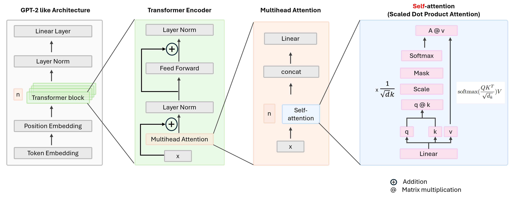
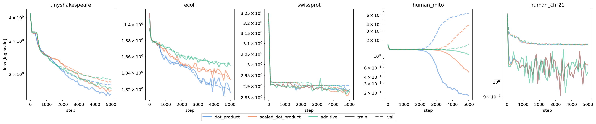

# LLM from Sratch

A GPT-style, decoder-only transformer built from scratch in PyTorch — attention, multi-head attention, layer norm, and linear projections are all implemented with raw tensor ops (no `nn.Linear`, `nn.LayerNorm`, `nn.MultiheadAttention`, or `nn.Transformer*` inside the package itself). The model is trained on TinyShakespeare with a character-level tokenizer.

Every module is grounded in the papers under [context/](context/) — see [docs/paper_mapping.md](docs/paper_mapping.md) for exactly which paper section each file implements.



## Setup

Install `uv`, create the virtual environment, then install torch and this package into it:

```bash
# curl -LsSf https://astral.sh/uv/install.sh | sh   # skip if uv is already installed
cd /storage/home/hcoda1/1/asingh3450/r-amadabhushi9-ext_em/code/explore/llm_from_sratch
uv venv .venv
uv pip install --python .venv/bin/python torch
uv pip install --python .venv/bin/python -e .
```

Activate the env:

```bash
cd /storage/home/hcoda1/1/asingh3450/r-amadabhushi9-ext_em/code/explore/llm_from_sratch
source .venv/bin/activate
```


## Results
#### Compare different attention types



#### Time comparison table

Wall-clock training time (5000 steps), by dataset and attention type:

| Dataset | dot_product | scaled_dot_product | additive |
|---|---|---|---|
| tinyshakespeare | TBD | TBD | TBD |
| ecoli | TBD | TBD | TBD |
| swissprot | TBD | TBD | TBD |
| human Mito | TBD | TBD | TBD |
| human Chr21 | TBD | TBD | TBD |

## Running the pipeline

1. **Prepare data** — downloads a corpus, builds the vocab, writes `data/<dataset>/*.pt`:
   ```bash
   python 101_prepare_data.py --dataset tinyshakespeare  # default
   python 101_prepare_data.py --dataset ecoli            # E. coli genome (DNA)
   python 101_prepare_data.py --dataset swissprot        # Swiss-Prot (protein)
   python 101_prepare_data.py --dataset human_mito       # human mitochondrial genome (DNA)
   python 101_prepare_data.py --dataset human_chr21      # human chromosome 21 (DNA)
   ```
   `102_train_model.py` / `103_generate_text.py` read the dataset via their `DATASET` constant at the top of each file — set it to match.
2. **Verify components** — numeric parity checks of each hand-implemented module against PyTorch's own built-ins:
   ```bash
   python 201_verify_attention.py      # ...through 209_verify_mla.py
   ```
3. **Train** — trains the GPT model, writes `checkpoints/gpt.pt`:
   ```bash
   python 102_train_model.py
   ```
   For a real (longer) run on a GPU node, submit it as a batch job instead of running interactively:
   ```bash
   sbatch 102_train_model.sbatch
   ```
4. **Generate** — loads the checkpoint and samples text:
   ```bash
   python 103_generate_text.py
   ```

## Repo layout

- [src/llm_from_scratch/](src/llm_from_scratch/) — the package itself:
  - `nn/` — attention, layer norm, transformer block, GPT
  - `attention_variants/` — KV cache, GQA, MLA
  - `data/` — tokenizer, dataset
  - `training/` — config, training loop, generation
- `1xx_*.py` — pipeline entry points (data prep, train, generate)
- `2xx_verify_*.py` — smoke tests: each hand-implemented component checked against PyTorch's built-in equivalent (`nn.LayerNorm`, `nn.MultiheadAttention`, `F.scaled_dot_product_attention`) for numeric and gradient parity
- [docs/paper_mapping.md](docs/paper_mapping.md) — module-to-paper-section index

## Paper mapping

"Paper A" = Serret 2026, arXiv:2604.00965v1, *Understanding Transformers and Attention Mechanisms: An Introduction for Applied Mathematicians*.

"Paper B" = Soydaner 2022, *Neural Computing and Applications*, *Attention Mechanism in Neural Networks: Where It Comes and Where It Goes* — background/history only, not a source for any implementation below.

"Paper C" = Vaswani 2023, *Attention Is All You Need*
/storage/home/hcoda1/1/asingh3450/r-amadabhushi9-ext_em/code/explore/llm_from_sratch/context/P3_2023 - Attention Is All You Need.pdf


| Module | Paper section | Concept implemented |
|---|---|---|
| `nn/attention.py` | Paper A S2.1, S3.2 | `Y = softmax(QK^T / sqrt(d_k) + M) V`; causal additive mask `M_ij = 0` if visible else `-inf` |
| `nn/multi_head_attention.py` | Paper A S2.2 | Per-head `W^Q_h, W^K_h, W^V_h` via combined `in_proj`; heads concatenated through `W^O` (`out_proj`) |
| `nn/transformer_block.py` | Paper A S3.2, S3.3 | Decoder block: causal self-attention + residual, feed-forward + residual. Pre-LN variant (Paper A S3.3 lists this as an alternative to its primary Post-LN diagram) |
| `nn/linear.py` | Paper A S2.1 | Explicit `W^Q/W^K/W^V/W^O` linear projection, implemented via raw matmul (no `nn.Linear`) |
| `nn/layer_norm.py` | not in Paper A | Ba et al. 2016, *Layer Normalization* |
| `nn/positional_encoding.py` | not in Paper A | Vaswani et al. 2017, *Attention Is All You Need* — fixed sin/cos positional encoding |
| `nn/feed_forward.py` | Paper A S3 (block diagrams) | Position-wise feed-forward sublayer |
| `nn/gpt.py` | Paper A S3.2 (decoder-only) | Stacked decoder blocks; weight tying and GPT-2-style init are engineering choices not sourced from either paper |
| `attention_variants/kv_cache.py` (Phase 2) | Paper A S4 | KV caching: `O(N^2 d)` full recompute vs `O(N d)` incremental decode |
| `attention_variants/gqa.py` (Phase 2) | Paper A S4.1 | Grouped/Multi-Query Attention |
| `attention_variants/mla.py` (Phase 2) | Paper A S4.2 | Multi-Head Latent Attention (low-rank KV compression) |
